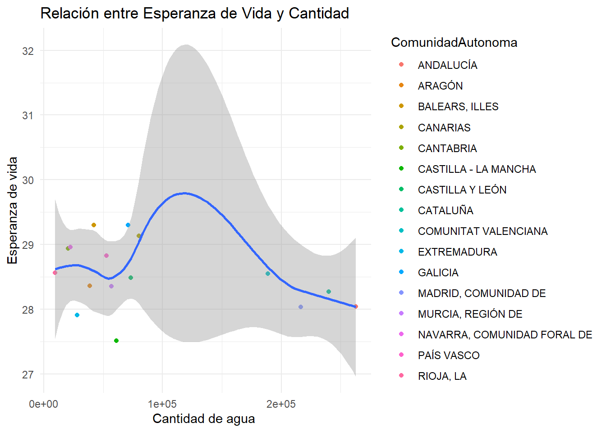
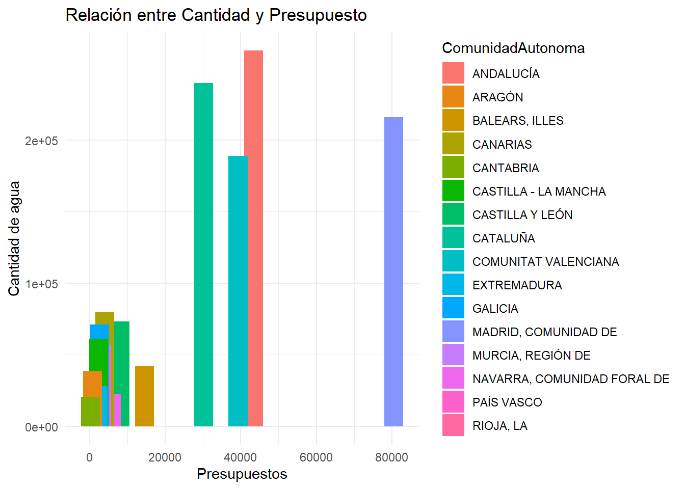
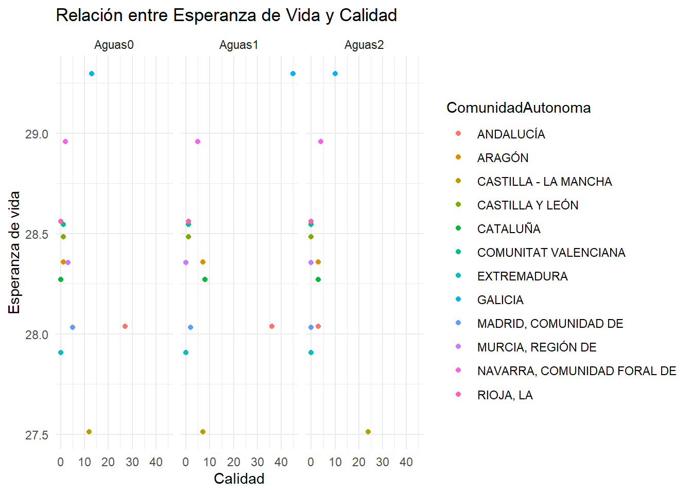
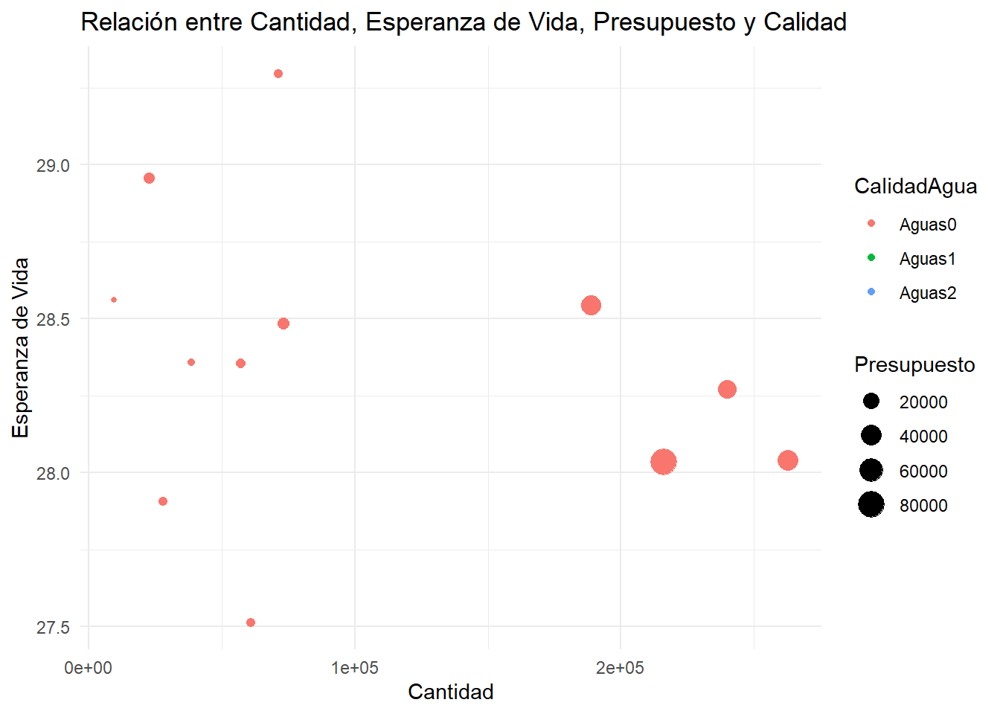

# Seminario Fuentes de Datos Biómedicas y Web Semántica

### Relación entre la Esperanza de vida y el Consumo de Agua

## Autores

-  Victoria Garcia Lovelle 
-  Paula Gregorio Losada
-  Urko Alli Barrena

## Fecha

11/12/2023

## Índice

1.  [Introducción](#Introducción)
2.  [Objetivos](#Objetivos)
3.  [Resultados](#Resultados)
4.  [Conclusión](#Conclusión)

# Introducción

En el desarrollo de este seminario, analizaremos cómo diversos aspectos relacionados con la calidad y cantidad de agua consumida pueden influir en la esperanza de vida en las diferentes Comunidades Autónomas de España.

Exploraremos detalladamente cómo la calidad del agua, medida a través de diferentes parámetros, y la cantidad de agua, pueden ser factores determinantes para la salud y, consecuentemente, para la esperanza de vida de las Comunidades Autónomas.

# Objetivos

El objetivo principal de este seminario es analizar de manera formal cómo diversos aspectos relacionados con la calidad y la cantidad de agua consumida pueden afectar en la esperanza de vida en las distintas Comunidades Autónomas de España. Se explorarán los siguientes puntos:

1.  **Afectación de la calidad del agua en la Esperanza de Vida:**
    -   Investigar cómo la calidad del agua puede tener repercusiones directas en la esperanza de vida de la población española por Comunidades Autónomas.
2.  **Afectación de la cantidad de agua consumida en la Esperanza de Vida:**
    -   Analizar de manera detallada cómo la cantidad de agua consumida puede influir en la esperanza de vida de la población española por Comunidades Autónomas.
3.  **Afectación del presupuesto para potabilizar agua con la cantidad de agua consumida:**
    -   Evaluar la relación entre el presupuesto destinado a la potabilización del agua y la cantidad de agua consumida, explorando posibles implicaciones para la esperanza de vida.
4.  **Impacto combinado de la calidad y cantidad de agua en la Esperanza de Vida:**
    -   Estudiar cómo la interacción entre la calidad y la cantidad de agua consumida puede tener un impacto significativo en la esperanza de vida de la población española por Comunidades Autónomas.

# Resultados

### **Relación entre esperanza de vida y cantidad**

En el eje de las abscisas se represemta la cantidad de agua consumida, mientras que en el eje de las ordenadas encontramos la esperanza de vida. La leyenda muestra que cada comunidad es representada en la gráfica mediante un color del gradiente y en forma circular. Finalmente, creamos un gráfico de dispersión y para poder entender mejor el patrón que estamos estudiando con esta gráfica. Podemos observar que no hay una relación directamente proporcional entre la cantidad de agua consumida y la esperanza de vida de cada Comunidad Autónoma. Sin embargo, al observar la línea de tendencia de nuestro gráfico, notamos que los extremos no son lo ideal. Por lo tanto, la tendencia nos sugiere que aquellos ciudadanos con una esperanza de vida potencialmente alta son aquellos que consumen una cantidad intermedia de agua.

### **Relación entre cantidad y presupuesto**

En el eje de las ordenadas encontramos la cantidad de agua consumida, y en el eje de las abscisas encontramos los presupuestos. Como podemos comprobar en la leyenda, cada comunidad será representada en la gráfica por un color perteneciente al gradiente y en forma de barra.

De este gráfico podemos notar una correlación entre el prespuesto invertido en agua y su consumo. Lugares como la Comunidad de Madrid, Andalucía o la Comunidad Valenciana encabezan los presupuestos más altos y el consumo de agua mayor. Por otro lado, La Rioja , Cantabria, Extremadura y Aragón, rondan los últimos puestos tanto en presupuesto como en cantidad. Podemos destacar Castilla-La Mancha, que con un gasto relativamente bajo en agua, tienen un consumo considerable, justo lo contrario de la Comunidad Foral de Navarra. Aun teniendo en cuenta las pocas comunidades que no se rigen por la normalidad de este gráfico, podemos afirmar que una mayor inversión por parte de las Comunidades Autónomas fomentan un mayor consumo de agua en sus habitantes.

### **Relación entre esperanza de vida y calidad**

Utilizamos como eje de abscisas la calidad del agua, mientras que de eje de ordenadas usamos la esperanza de vida. Agregamos puntos al gráfico asignando colores que representaran a cada Comunidad Autónoma. Al tener varios datos de la calidad del agua, dividimos las facetas organizándolas en una sola fila.

Las tres clases de agua nos indican el grado de calidad de estas siendo las "Aguas 2" las de mejor calidad y las "Aguas 0" las de peor calida. Estuadiando el porcentaje de uso de cada clase de agua por comunidad llegamos a la conclusion de que no hay ninguna relación a primera vista sobre la calidad de agua utilizada y la esperanza de vida, porque comunidades con alto uso de "Aguas 2" como Castilla-La Mancha tienen una esperanza de vida baja y comunidades que usan en su mayoria "Aguas 0" como Murcia y Asturias tienen una esperanza de vida en la medida de lo normal.

###  **Relación entre cantidad, esperanza de vida, presupuesto y calidad**

Este último gráfico es la relación entre las cuatro variables deestudio. Se trata de un gráfico de dispersión en donde en el eje de abscisas se representa la cantidad de agua consumida y en el eje de las ordenadas se reprsenta la esperanza de vida. La calidad del agua le dará el color a los puntos y su tamaño será en función del presupuesto.

Podemos ver que la relación entre presupuesto y la cantidad de agua consumida si que es notoria. No obstante, se observa que la esperanza de vida no se ve afectada por el presupuesto. Podemos comprobar que los extremos en la variable de la cantidad de agua si que perjudican a la esperanza de vida; aquellos que consumen mucha agua o muy poca tienen una esperanza de vida relativamente inferior a los que consumen una cantidad intermedia. Por otro lado, al superponerse los puntos de calidad de agua, se evidencia que realmente no es una variable que afecte directamente a nuestro estudio. Como conclusión, la esperanza de vida tiende a ser mayor si nuestro consumo de agua no excede ningun límite, permitiendo asi que aquellas Comunidades Autónomas que invierten mucho en el consumo de agua puedan reducir dicha inversión.
# Conclusión

A lo largo de este seminario, hemos relacionado las distintas variables con el fin de comprobar si realmente afectan o no a la esperanza de vida. Como conclusión, la esperanza de vida tiende a ser mayor si nuestro consumo de agua no excede ningun límite, permitiendo asi que aquellas Comunidades Autónomas que invierten una gran cantidad en el consumo de agua puedan reducir dicha inversión.

